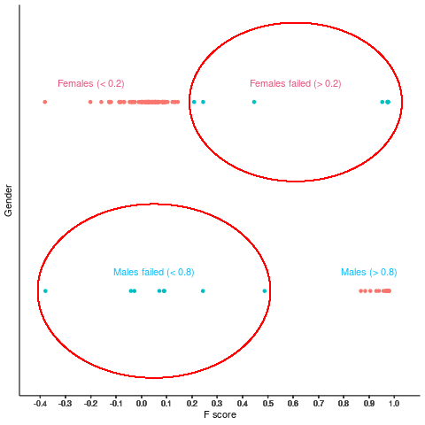
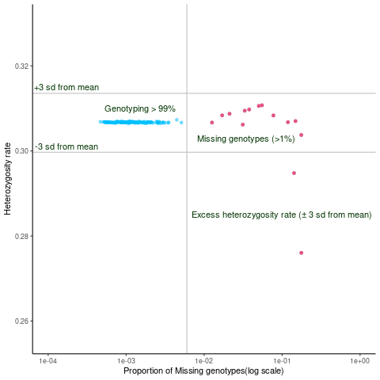
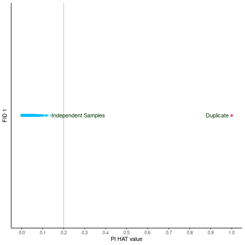

# Per Individual Quality Control

Per-individual QC screens genotype to identify subjects that may
introduce bias, if not removed. Poorly genotyped (low call rate)
individuals will increase error in the study and may significantly
affect the results. There are several steps of per-individual QC for a
GWAS data set.

### Step 1: Converting ped and map into binary format

#### PLINK command

    ./plink –file raw_GWAS_data --make-bed

### Step 2: Identification of individuals with discordant sex information

#### PLINK command

    ./plink --bfile raw_GWAS_data --check-sex --out GWAS_Sex_Check

-   Command Create a list of individuals with discordant sex data in
    file “GWAS\_Sex\_Check.sexcheck”. Column 3 denotes ascertained sex
    and column 4 denotes sex according to genotype data. When the
    homozygosity rate is more than 0.2 but less than 0.8, the genotype
    data are inconclusive regarding the sex of an individual and these
    are marked in column 4 with a 0.
-   Extract the IDs of individuals with discordant sex information. In
    situations in which discrepancy cannot be resolved, remove the
    individuals through following command.     PLINK command  
    **plink –bfile raw\_GWAS\_data –remove
    discordant-sex-individuals-file.txt –make-bed –out
    1\_QC\_Raw\_GWAS\_data**     (File
    “discordant-sex-individuals-file.txt”, should contain only FID and
    IID of the individuals that have to be removed)

<!-- -->

    Gender <- read.table("Sex_check_1.sexcheck", header = T, as.is = T) %>%
      na.omit()
    png("Gender_check.png")
    ggplot(Gender, aes(x=F, y= PEDSEX, col = STATUS))+
      geom_point()+
      labs(y="Gender", x = "F score")+
      theme_classic()+
      scale_x_continuous(breaks = round(seq(min(Gender$F), 1, by = 0.01), 1))+
      theme(strip.text.x = element_blank())+
      geom_circle(aes(x0 = 0.61,  y0 = 2, r = 0.42),
                  inherit.aes = FALSE,
                  col = "Red")+
      geom_circle(aes(x0 = 0.05,  y0 = 1, r = 0.46),
                  inherit.aes = FALSE,
                  col = "Red")+
      theme(axis.text.y = element_blank(),
            axis.ticks.y = element_blank(),
            legend.position = "none")+
      annotate(geom="text", x=-0.2, y=2.1, label="Females (< 0.2)",
               color="#e75480")+
      annotate(geom="text", x=0.9, y=1.1, label="Males (> 0.8)",
               color="#00bfff")+
      annotate(geom="text", x=0.61, y=2.1, label="Females failed (> 0.2)",
               color="#e75480")+
      annotate(geom="text", x=0.05, y=1.1, label="Males failed (< 0.8)",
               color="#00bfff")
    dev.off()

Discordant Sex information

### Step 3: Identification of individuals with elevated missing data rates

  PLINK command   **./plink2 –bfile 1\_QC\_Raw\_GWAS\_data
–missing –out missing\_data\_rate**   - Command creates the files
“missing\_data\_rate.imiss” and “missing\_data\_rate.lmiss”. - The
fourth column in the .imiss file (N\_MISS) denotes the number of missing
SNPs and the sixth column (F\_MISS) denotes the proportion of missing
SNPs per individual.

### Step 4: Identification of individuals with outlying heterozygosity rate

  PLINK command   **./plink –bfile 1\_QC\_Raw\_GWAS\_data –het
–out outlying\_heterozygosity\_rate**     **NOTE: plink2 format
will give results in a different way**   - Command creates the file
“outlying\_heterozygosity\_rate.het”, in which the third column denotes
the observed number of homozygous genotypes \[O(Hom)\] and the fifth
column denotes the number of non-missing genotypes \[N(NM)\] per
individual.

    # Missing individual & Heterozygosity rate
    miss <- fread("SEX_data/Missing_sample/missing_data_rate.imiss")
    hetro <- fread("SEX_data/Missing_sample/Heterozygosity_rate/outlying_heterozygosity_rate.het")
    head(miss, 2)
    head(hetro, 2)

    # Calculate the observed heterozyosity rate
    hetro$obs_hetero_rate <- ((hetro$`N(NM)`)-hetro$`E(HOM)`)/hetro$`N(NM)`

-   Merge the “missing\_data\_rate.smiss” and
    “outlying\_heterozygosity\_rate.het” hetroandmiss&lt;- merge(hetro,
    miss, by=“IID”)

<!-- -->

    # Merge missing file and heterozygoisty file
    hetro_miss <- miss %>% 
      left_join(hetro, by = "IID")

    # Creating plot
    png("Missing_hetero_check.png")
    ggplot(hetro_miss, aes(x = F_MISS, y = obs_hetero_rate))+
      geom_point(alpha = 0.5, col = "#00bfff")+
      labs(x ="Proportion of Missing genotypes(log scale)", y = "Heterozygosity rate")+
      scale_x_log10(limits = c(0.0001, 1))+
      theme_classic()+
      scale_y_continuous(limits = c((min(hetro_miss$obs_hetero_rate) - 0.02), (max(hetro_miss$obs_hetero_rate) + 0.02)))+
      geom_hline(yintercept = mean(hetro_miss$obs_hetero_rate) + 3*sd(hetro_miss$obs_hetero_rate), col = "Grey")+
      geom_hline(yintercept = mean(hetro_miss$obs_hetero_rate) - 3*sd(hetro_miss$obs_hetero_rate), col = "Grey")+
      geom_vline(xintercept = 0.006, col = "Grey")+
      geom_point(data=hetro_miss %>%
                   filter(F_MISS > 0.01),
                 pch = 19,
                 size=1.6,
                 colour = "#e75480")+
      annotate(geom="text", x=0.035, y=0.303, label="Missing genotypes (>1%)",
               color="#003300")+
      annotate(geom="text", x=0.1, y=0.285, label="Excess heterozygosity rate (± 3 sd from mean)",
               color="#003300")+
      annotate(geom="text", x=0.00017, y=0.315, label="+3 sd from mean",
               color="#003300")+
      annotate(geom="text", x=0.00017, y=0.301, label="-3 sd from mean",
               color="#003300")+
      annotate(geom="text", x=0.0015, y=0.31, label="Genotyping > 99%",
               color="#003300")

    dev.off()

Individual missingness and heterozygoisty rate

### Step 5: Identification of duplicated or related individuals

-   Check the relatedness. Use the independent SNPs (pruning) for this
    analysis and limit to autosomal chromosome only   PLINK command
      **plink –bfile 2\_QC\_Raw\_GWAS\_data –chr 1-22 –make-bed –out
    Autosomal**
-   Create independent SNPs through pruning   PLINK command  
    **plink –bfile Autosomal –indep-pairwise 50 5 0.2 –out
    raw-GWAS-data**   it will generate raw-GWAS-data.prune.in file.
    This file use in next step
-   Check relatedness   PLINK command   **./plink –bfile
    2\_QC\_Raw\_GWAS\_data –extract raw-GWAS-data.prune.in –genome –out
    related\_check**  

<table>
<thead>
<tr>
<th>PIHAT values</th>
<th>Relation</th>
</tr>
</thead>
<tbody>
<tr>
<td>1</td>
<td>Identical or Duplicate</td>
</tr>
<tr>
<td>0.8 and above</td>
<td>Highly related</td>
</tr>
<tr>
<td>0.5</td>
<td>First Degree</td>
</tr>
<tr>
<td>0.25</td>
<td>Highly related</td>
</tr>
<tr>
<td>0.125</td>
<td>First Cousin</td>
</tr>
<tr>
<td>0.0625</td>
<td>Second Cousin</td>
</tr>
</tbody>
</table>

Relatedness

### Step 6: Identification of Individuals of divergent ancestry

#### Approach 1: Multidimensional scaling

  PLINK Command   **plink –bfile 3\_QC\_Raw\_GWAS\_data –extract
raw-GWAS-data.prune.in –genome –cluster –mds-plot 10**

-   Visualizing population structure using MDS is useful for identifying
    subpopulations, population stratification and systematic genotyping
    or sequencing errors, and can also be used to detect individual
    outliers that may need to be removed, e.g. European-Americans
    included in a study of African-Americans.

#### Approach 2: Principal component analysis

  PLINK Command   **plink –bfile 3\_QC\_Raw\_GWAS\_data –genome
–cluster –pca 10** - We can also utilize hapmap data to perform PCA
