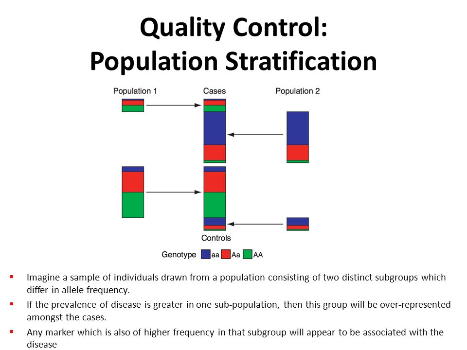

# Identification of Individuals of divergent ancestry

In GWAS QC, this step means detecting individuals in our sample whose
genetic ancestry is **different** from your main study population.

For example: \* If you are studying a European cohort but you
accidentally have individuals with recent African or East Asian ancestry
mixed in. \* Or, you might see subtle structure: like Southern
vs. Northern Europeans in the same cohort.

### Why is this a problem in GWAS?

The main issue is **population stratification**:

-   Allele frequencies vary naturally between populations due to
    ancestry.
-   If ancestry is mixed, you may see **spurious associations** —
    variants that differ because of ancestry **and not because they’re
    truly related to your trait**.
-   This produces **false positives**, biased effect estimates, and can
    completely distort your results.

**Example**: If cases and controls have slightly different ancestry on
average (e.g., more cases with Southern European ancestry), you might
find SNPs that simply tag that ancestry — not your disease!

> So: Ancestry outliers must be checked, flagged, and handled properly.

#### Issues if not handled

-   False positive hits.
-   Genomic inflation factor (lambda) &gt; 1.
-   Invalid p-values.
-   Poor replicability in other cohorts.

Population Stratification

[Image Credit](https://slideplayer.com/slide/11710376/)

#### Approach 1: Multidimensional scaling

#### PLINK Command

    .\plink --bfile 3_QC_Raw_GWAS_data --extract raw-GWAS-data.prune.in --genome --cluster --mds-plot 10

-   Visualizing population structure using MDS is useful for identifying
    subpopulations, population stratification and systematic genotyping
    or sequencing errors, and can also be used to detect individual
    outliers that may need to be removed, e.g. European-Americans
    included in a study of African-Americans.

#### Approach 2: Principal component analysis

#### PLINK Command

    .\plink --bfile 3_QC_Raw_GWAS_data --genome --cluster --pca 10

-   We can also utilize hapmap data to perform PCA
