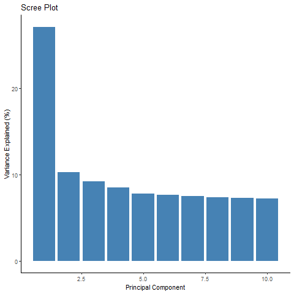

# Identification of Individuals of divergent ancestry

In GWAS QC, this step means detecting individuals in our sample whose
genetic ancestry is **different** from our main study population.

For example:

-   If we are studying a European cohort but we accidentally have
    individuals with recent African or East Asian ancestry mixed in.
-   Or, we might see subtle structure: like Southern vs. Northern
    Europeans in the same cohort.

### Why is this a problem in GWAS?

The main issue is **population stratification**:

-   Allele frequencies vary naturally between populations due to
    ancestry.
-   If ancestry is mixed, we may see **spurious associations** —
    variants that differ because of ancestry **and not because they’re
    truly related to our trait**.
-   This produces **false positives**, biased effect estimates, and can
    completely distort our results.

**Example**: If cases and controls have slightly different ancestry on
average (e.g., more cases with Southern European ancestry), we might
find SNPs that simply tag that ancestry — not our disease!

> So: Ancestry outliers must be checked, flagged, and handled properly.

#### Issues if not handled

-   False positive hits.
-   Genomic inflation factor (lambda) &gt; 1.
-   Invalid p-values.
-   Poor replicability in other cohorts.

Population Stratification

[Image Credit](https://slideplayer.com/slide/11710376/)

#### How do we identify ancestry outliers?

The **standard method** is **Principal Component Analysis (PCA)**.

PCA summarizes genome-wide genetic variation into axes (PC1, PC2, …):

-   Individuals with similar ancestry cluster together in PC space.
-   Outliers will appear **far from the main cluster**.

#### Approach 1: Multidimensional scaling

Multidimensional Scaling (MDS) is a dimensionality reduction method used
to visualize genetic distances between individuals in a dataset.

-   It converts a **pairwise distance matrix** (how genetically similar
    or different each pair of individuals is) into coordinates in a
    lower-dimensional space — usually 2D or 3D — so we can **plot
    them**.

-   MDS is very similar in goal to **PCA**: both help us **see hidden
    structure**, like clusters that reflect **ancestry or population
    stratification**.

#### Why use MDS for population stratification?

MDS helps **detect subtle ancestry differences** and hidden population
structure. \* Just like PCA, it can reveal:

-   Different ancestral groups (e.g., European vs. Asian clusters).
-   Cryptic structure within a single ancestry.
-   Unexpected outliers that need to be removed to avoid false
    positives.

#### PLINK Command

    ./plink --bfile Relatedness --extract PRUNE_DATA.prune.in --genome --cluster --mds-plot 10

-   `--extract PRUNE_DATA.prune.in`: Autosomal pruned SNP during
    Relatedness check

-   `--genome`: This computes the pairwise IBS/IBD matrix for all pairs
    of individuals.

-   `--cluster`: This runs clustering based on the IBS matrix.

-   `--mds-plot 10`: This tells PLINK to perform Multidimensional
    Scaling (MDS) on the distance matrix, then generate coordinates for
    the first 10 MDS dimensions.

-   This command will give `plink.mds` file with FID, IID, and MDS1,
    MDS2, …

-   Visualizing population structure using MDS is useful for identifying
    subpopulations, population stratification and systematic genotyping
    or sequencing errors, and can also be used to detect individual
    outliers that may need to be removed, e.g. European-Americans
    included in a study of African-Americans.

<!-- -->

    MDS <- fread("plink.mds")
    MDS

    ###  Get the mean and standard deviation for each dimension 
    mean_C1 <- mean(MDS$C1)
    sd_C1 <- sd(MDS$C1)

    mean_C2 <- mean(MDS$C2)
    sd_C2 <- sd(MDS$C2)

    #### Find outliers
    MDS$outlier <- ifelse(
      abs(MDS$C1 - mean_C1) > 3 * sd_C1 |
        abs(MDS$C2 - mean_C2) > 3 * sd_C2,
      "Outlier", "Inlier"
    )

    # Create a scatterplot of the MDS dimensions
    png("MDS_population_stratification.png")
    ggplot(MDS, aes(x = C1, y = C2, color = outlier)) +
      geom_point(size = 2) +
      xlab("MDS Dimension 1") +
      ylab("MDS Dimension 2") +
      ggtitle("MDS Plot: Dimension 1 vs Dimension 2")+
      scale_x_continuous(
        limits = c(-0.1, 0.15),  # Example range, adjust as needed
        breaks = seq(-0.1, 0.15, by = 0.05)
      ) +
      scale_y_continuous(
        limits = c(-0.2, 0.4),
        breaks = seq(-0.2, 0.4, by = 0.05)
      ) +
      theme_classic()

Population Stratification by Multidimensional Scaling

#### Approach 2: Principal component analysis

**Principal Component Analysis (PCA)** is a statistical method that
reduces our **genome-wide SNP data** into **principal components (PCs)**
— axes that summarize the **major directions of genetic variation**.

#### In a GWAS:

PCA is used to:

-   Detect hidden population structure (e.g., subtle ancestry
    differences).
-   Identify ancestry outliers.
-   Provide PCs as covariates to adjust for stratification, which helps
    **prevent false positives**.

#### Why do we run PCA in GWAS?

-   Different ancestral groups naturally have different allele
    frequencies.

-   If not adjusted, this population stratification can cause SNPs to
    appear associated with our trait just because they track ancestry —
    not because they affect the trait.

PCA solves this by:

-   1.  Revealing structure (plots show clusters).
-   1.  Providing PCs as **numerical covariates** to include in our
        association model.

#### PLINK Command to create 10 PC

    ./plink --bfile Relatedness --extract PRUNE_DATA.prune.in --genome --cluster --pca 10 --out PCA

#### Output:

-   PCA.eigenvec → individuals’ coordinates on each PC.
-   PCA.eigenval → eigenvalues (variance explained).

<!-- -->

    # Read eigenvalues and eigenvectors
    eigenvalues <- fread("plink.eigenval")
    eigenvectors <- fread("plink.eigenvec")

    # Add PC numbers and percent variance
    eigenvalues$PC <- 1:nrow(eigenvalues)
    eigenvalues$variance_percent <- round((eigenvalues$V1 / sum(eigenvalues$V1)) * 100, 2)

    # Scree plot
    ggplot(eigenvalues, aes(x = PC, y = variance_percent)) +
      geom_bar(stat = "identity", fill = "steelblue") +
      labs(
        title = "Scree Plot",
        x = "Principal Component",
        y = "Variance Explained (%)"
      ) +
      theme_classic()

Scree Plot

    # Calculate PC1 and PC2 mean/sd
    mean_PC1 <- mean(eigenvectors$V3)
    sd_PC1 <- sd(eigenvectors$V3)

    mean_PC2 <- mean(eigenvectors$V4)
    sd_PC2 <- sd(eigenvectors$V4)

    # Flag outliers
    eigenvectors$outlier <- ifelse(
      abs(eigenvectors$V3 - mean_PC1) > 3 * sd_PC1 |
        abs(eigenvectors$V4 - mean_PC2) > 3 * sd_PC2,
      "Outlier", "Inlier"
    )

#### Creating plot between PC1 and PC2

    # Plot with outliers
    png("PC_plot.png")
    ggplot(eigenvectors, aes(x = V3, y = V4, color = outlier)) +
      geom_point(size = 2) +
      labs(
        title = "PCA: Outlier Detection",
        x = paste0("PC1 (", eigenvalues$variance_percent[1], "%)"),
        y = paste0("PC2 (", eigenvalues$variance_percent[2], "%)")
      ) +
      scale_x_continuous(
        limits = c(-0.3, 0.2),  # Example range, adjust as needed
        breaks = seq(-0.3, 0.2, by = 0.2)
      ) +
      scale_y_continuous(
        limits = c(-0.8, 0.5),
        breaks = seq(-0.8, 0.5, by = 0.2)
      ) +
      theme_classic()

Principal Component 1 vs Principal Component 2

#### Saving outliers

    # Save outlier list for PLINK
    outliers <- subset(eigenvectors, outlier == "Outlier")
    write.table(outliers[, c("V1", "V2")],
                "PCA_outliers.txt",
                quote = FALSE, row.names = FALSE, col.names = FALSE)

#### PLINK command to remove outliers using Principal Components

    ./plink --bfile 3_QC_Raw_GWAS_data --remove PCA_outliers.txt --make-bed --out 4_QC_Raw_GWAS_data

This step will remove samples identified outliers.

-   **Note**: Even after removing clear outliers, subtle structure
    remains → include top PCs as covariates for final analysis

# References

1- Marees, A.T., et al, 2018. A tutorial on conducting genome‐wide
association studies: Quality control and statistical analysis. *Int J
Methods Psychiatr Res*, Jun; 27(2): e1608.

2- Anderson, C.A. et al, 2010. Data quality control in genetic
case-control association studies. *Nat Protoc*, Sep:5(9):1564-73

3- Singh, Sandeep Kumar, “A Case-Only Genome-wide Association Study of
Gender- and Age-specific Risk Markers for Childhood Leukemia” (2015).
FIU Electronic Theses and Dissertations. 1832
