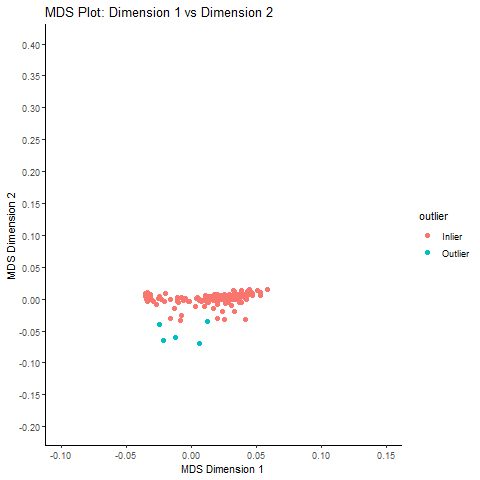

# Identification of Individuals of divergent ancestry

In GWAS QC, this step means detecting individuals in our sample whose
genetic ancestry is **different** from your main study population.

For example:

-   If we are studying a European cohort but we accidentally have
    individuals with recent African or East Asian ancestry mixed in.
-   Or, we might see subtle structure: like Southern vs. Northern
    Europeans in the same cohort.

### Why is this a problem in GWAS?

The main issue is **population stratification**:

-   Allele frequencies vary naturally between populations due to
    ancestry.
-   If ancestry is mixed, we may see **spurious associations** —
    variants that differ because of ancestry **and not because they’re
    truly related to your trait**.
-   This produces **false positives**, biased effect estimates, and can
    completely distort your results.

**Example**: If cases and controls have slightly different ancestry on
average (e.g., more cases with Southern European ancestry), you might
find SNPs that simply tag that ancestry — not your disease!

> So: Ancestry outliers must be checked, flagged, and handled properly.

#### Issues if not handled

-   False positive hits.
-   Genomic inflation factor (lambda) &gt; 1.
-   Invalid p-values.
-   Poor replicability in other cohorts.

Population Stratification

[Image Credit](https://slideplayer.com/slide/11710376/)

#### How do we identify ancestry outliers?

The **standard method** is **Principal Component Analysis (PCA)**.

PCA summarizes genome-wide genetic variation into axes (PC1, PC2, …):

-   Individuals with similar ancestry cluster together in PC space.
-   Outliers will appear **far from the main cluster**.

#### Approach 1: Multidimensional scaling

Multidimensional Scaling (MDS) is a dimensionality reduction method used
to visualize genetic distances between individuals in a dataset.

-   It converts a **pairwise distance matrix** (how genetically similar
    or different each pair of individuals is) into coordinates in a
    lower-dimensional space — usually 2D or 3D — so we can **plot
    them**.

-   MDS is very similar in goal to **PCA**: both help us **see hidden
    structure**, like clusters that reflect **ancestry or population
    stratification**.

#### Why use MDS for population stratification?

MDS helps **detect subtle ancestry differences** and hidden population
structure. \* Just like PCA, it can reveal: \* Different ancestral
groups (e.g., European vs. Asian clusters). \* Cryptic structure within
a single ancestry. \* Unexpected outliers that need to be removed to
avoid false positives.

#### PLINK Command

    .\plink --bfile 3_QC_Raw_GWAS_data --extract raw-GWAS-data.prune.in --genome --cluster --mds-plot 10

-   `--genome`: This computes the pairwise IBS/IBD matrix for all pairs
    of individuals.

-   `--cluster`: This runs clustering based on the IBS matrix.

-   `--mds-plot 10`: This tells PLINK to perform Multidimensional
    Scaling (MDS) on the distance matrix, then generate coordinates for
    the first 10 MDS dimensions.

-   This command will give `plink.mds` file with FID, IID, and MDS1,
    MDS2, …

-   Visualizing population structure using MDS is useful for identifying
    subpopulations, population stratification and systematic genotyping
    or sequencing errors, and can also be used to detect individual
    outliers that may need to be removed, e.g. European-Americans
    included in a study of African-Americans.

<!-- -->

    MDS <- fread("D:/UNIX/GWAS/plink_linux_x86_64_20230116/Sex_check/Missing_Heter/Relatedness/MDS/plink.mds")
    MDS

    ###  Get the mean and standard deviation for each dimension 
    mean_C1 <- mean(MDS$C1)
    sd_C1 <- sd(MDS$C1)

    mean_C2 <- mean(MDS$C2)
    sd_C2 <- sd(MDS$C2)

    #### Find outliers
    MDS$outlier <- ifelse(
      abs(MDS$C1 - mean_C1) > 3 * sd_C1 |
        abs(MDS$C2 - mean_C2) > 3 * sd_C2,
      "Outlier", "Inlier"
    )

    # Create a scatterplot of the MDS dimensions
    png("MDS_population_stratification.png")
    ggplot(MDS, aes(x = C1, y = C2, color = outlier)) +
      geom_point(size = 2) +
      xlab("MDS Dimension 1") +
      ylab("MDS Dimension 2") +
      ggtitle("MDS Plot: Dimension 1 vs Dimension 2")+
      theme_classic()

Population Stratification by Multidimensional Scaling

#### Approach 2: Principal component analysis

#### PLINK Command

    .\plink --bfile 3_QC_Raw_GWAS_data --genome --cluster --pca 10

-   We can also utilize hapmap data to perform PCA
