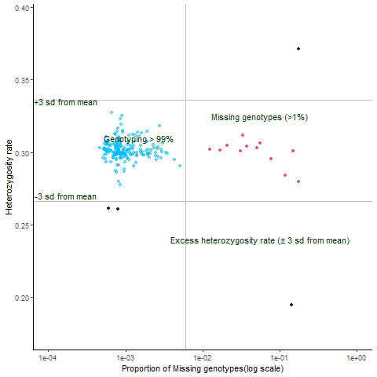

# Identification of individuals with outlying heterozygosity rate

**Heterozygosity rate** is the proportion of genotyped SNPs in an
individual that are **heterozygous** — meaning the person carries **two
different alleles** at that site (e.g., A/G instead of A/A or G/G).

In simple terms, it measures **how much genetic variation** we see
**within each individual** across the autosomes (the non-sex
chromosomes).

The heterozygosity rate is an important **per-sample QC** metric in GWAS
because it can reveal **biological or technical problems** in your data.

### 1. Expected Pattern:

Most individuals from the same ancestry will have **similar
heterozygosity rates**, because the expected level of genetic variation
is stable within a population.

### 2. Low Heterozygosity:

If an individual’s heterozygosity rate is **much lower** than the rest:
\* It might indicate **inbreeding** (more homozygous genotypes than
expected). \* Or poor genotyping quality that caused some heterozygous
calls to be missed.

### 3. High Heterozygosity:

If an individual’s heterozygosity rate is **unusually high**: \* It can
signal **DNA contamination** (e.g., DNA from two people mixed, showing
extra heterozygous calls). \* Or systematic genotyping error.

#### How is it Used in QC?

-   We calculate each sample’s heterozygosity rate across autosomal
    SNPs.
-   Plot the distribution.
-   Remove outliers (typically samples &gt;3 standard deviations from
    the mean).
-   This keeps our dataset free from hidden contamination, inbreeding
    artifacts, or low-quality samples.

#### PLINK command

    ./plink --bfile 1_QC_Raw_GWAS_data --het --out outlying_heterozygosity_rate

<table>
<thead>
<tr>
<th>FID</th>
<th>IID</th>
<th>O(HOM)</th>
<th>E(HOM)</th>
<th>N(NM)</th>
<th>F</th>
</tr>
</thead>
<tbody>
<tr>
<td>1</td>
<td>201320</td>
<td>228640</td>
<td>2.259e+05</td>
<td>325867</td>
<td>0.0272</td>
</tr>
<tr>
<td>1</td>
<td>201337</td>
<td>227550</td>
<td>2.26e+05</td>
<td>326067</td>
<td>0.01506</td>
</tr>
</tbody>
</table>

**NOTE: plink2 format will give results in a different way**

-   Command creates the file “outlying\_heterozygosity\_rate.het”, in
    which the third column denotes the observed number of homozygous
    genotypes \[O(Hom)\] and the fifth column denotes the number of
    non-missing genotypes \[N(NM)\] per individual.

<!-- -->

    # Missing individual & Heterozygosity rate
    miss <- fread("SEX_data/Missing_sample/missing_data_rate.imiss")
    hetro <- fread("SEX_data/Missing_sample/Heterozygosity_rate/outlying_heterozygosity_rate.het")
    head(miss, 2)
    head(hetro, 2)

Next we calculate observed heterozygosity rate

$$
\large \text {Observed Heterozygosity Rate} = \frac {\text {non-missing genotypes (N(NM)) - Observed number of homozygous genotypes (O(HOM))}}{\text {non-missing genotypes (N(NM))}} 
$$

    # Calculate the observed heterozyosity rate
    hetro$obs_hetero_rate <- ((hetro$`N(NM)`)-hetro$`O(HOM)`)/hetro$`N(NM)`

-   Merge the miss and hetro dataframe above created

<!-- -->

    # Merge missing file and heterozygoisty file
    hetro_miss <- miss %>% 
      left_join(hetro, by = "IID")

    # Creating plot
    png("Missing_hetero_check.png")
    ggplot(hetro_miss, aes(x = F_MISS, y = obs_hetero_rate))+
      geom_point(alpha = 0.5, col = "#00bfff")+
      labs(x ="Proportion of Missing genotypes(log scale)", y = "Heterozygosity rate")+
      scale_x_log10(limits = c(0.0001, 1))+
      theme_classic()+
      scale_y_continuous(limits = c((min(hetro_miss$obs_hetero_rate) - 0.02), (max(hetro_miss$obs_hetero_rate) + 0.02)))+
      geom_hline(yintercept = mean(hetro_miss$obs_hetero_rate) + 3*sd(hetro_miss$obs_hetero_rate), col = "Grey")+
      geom_hline(yintercept = mean(hetro_miss$obs_hetero_rate) - 3*sd(hetro_miss$obs_hetero_rate), col = "Grey")+
      geom_vline(xintercept = 0.006, col = "Grey")+
      geom_point(data=hetro_miss %>%
                   filter(F_MISS > 0.01),
                 pch = 19,
                 size=1.6,
                 colour = "#e75480")+
      annotate(geom="text", x=0.035, y=0.303, label="Missing genotypes (>1%)",
               color="#003300")+
      annotate(geom="text", x=0.1, y=0.285, label="Excess heterozygosity rate (± 3 sd from mean)",
               color="#003300")+
      annotate(geom="text", x=0.00017, y=0.315, label="+3 sd from mean",
               color="#003300")+
      annotate(geom="text", x=0.00017, y=0.301, label="-3 sd from mean",
               color="#003300")+
      annotate(geom="text", x=0.0015, y=0.31, label="Genotyping > 99%",
               color="#003300")

    dev.off()

The above R script will create a png file containing information based
on missing rate and heterozygosity rate. For missing rate we set a
threshold value &lt; 0.01 and for heterzygosity rate between + and - 3
standard deviation.

Individual missingness and heterozygoisty rate

The heterozygosity rate is a simple but powerful QC check. By flagging
individuals with too high or too low genetic diversity, it protects your
study from spurious associations, contamination, or undetected
population structure — ensuring your GWAS results are robust and
replicable.

#### Reference

-   Anderson CA et al., 2010. Data quality control in genetic
    case-control association studies. Nat Protoc.
-   Marees AT et al., 2018. A tutorial on conducting genome-wide
    association studies: Quality control and statistical analysis. Int J
    Methods Psychiatr Res.
-   Purcell S et al., 2007. PLINK: A Tool Set for Whole-Genome
    Association and Population-Based Linkage Analyses. Am J Hum Genet.
