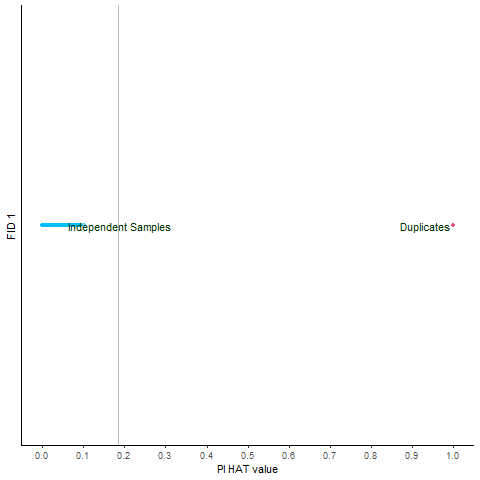

# Relatedness

**Relatedness QC** is the step in genome-wide association studies where
we **identify and manage individuals who are closely related to each
other** in your sample.

Most GWAS assume that all individuals are **statistically independent**
— meaning they’re **unrelated** beyond distant population-level
relationships. If we leave related samples in the dataset, they can
cause **inflated test statistics**, spurious associations, or biased
heritability estimates.

### Why Related Individuals Cause Problems

-   **Non-independence**: Related individuals share long stretches of
    DNA identical by descent (IBD). This means their genotypes are not
    fully independent observations.

-   **Allele frequency bias**: The presence of close relatives can
    over-represent certain alleles in your sample.

-   **Inflated test statistics**: The GWAS model assumes that the errors
    are independent. Relatedness violates this, so your p-values may be
    **too small** — leading to false positives.

#### How is Relatedness Measured?

The **relatedness coefficient (or pi-hat)** estimates the proportion of
the genome that two individuals share **identical by descent (IBD)**.

**Standard thresholds**:

<table>
<colgroup>
<col style="width: 50%" />
<col style="width: 50%" />
</colgroup>
<thead>
<tr>
<th>PIHAT values</th>
<th>Relation</th>
</tr>
</thead>
<tbody>
<tr>
<td>1</td>
<td>Indicates identical twins or duplicates, where individuals share
100% of their genome IBD.</td>
</tr>
<tr>
<td>0.5</td>
<td>Suggests first-degree relatives, like parent and child or siblings,
sharing approximately 50% of their genome IBD.</td>
</tr>
<tr>
<td>0.25</td>
<td>Indicates second-degree relatives, like grandparents and
grandchildren or half-siblings, sharing about 25% of their genome
IBD.</td>
</tr>
<tr>
<td>0.125</td>
<td>Indicates third-degree relatives, like first cousins, sharing
roughly 12.5% of their genome IBD</td>
</tr>
</tbody>
</table>

### Identical By Descent (IBD)

#### Definition:

Two alleles are **Identical By Descent (IBD)** if they are **exact
copies inherited from the same ancestor without any mutation in
between**.

#### Key point:

IBD means there is a **known common ancestor** in the family tree — the
alleles are **genetically “linked” through inheritance**.

#### Example:

If you and your sibling both have an “A” allele at a locus, and you both
got it from your mother, that “A” is IBD.

### When is IBD used?

-   To measure **relatedness** in families: siblings, parent–child,
    cousins.
-   To detect **pedigree structure**.
-   In **pi-hat calculations**, where you want to estimate how much DNA
    two people share because of shared ancestry.
-   For **linkage studies**, where you track inheritance in families to
    find disease genes.

Identical By Descent

### Identical By State (IBS)

Two alleles are **Identical By State (IBS)** if they are **the same
allele type**, regardless of whether they come from the **same
ancestor**.

IBS only looks at the current state of the allele — not how it got
there.

#### Example:

A random person ad I both have an “A” at a SNP — but maybe I got mne
from my mom’s lineage and they got theirs from an unrelated lineage.
**These two alleles are IBS, but not necessarily IBD**.

#### When is IBS used?

-   To compute **genetic similarity** between any two individuals, even
    if they’re unrelated.
-   IBS is the **observed data** — the raw count of matching alleles.
-   Tools like PLINK compare IBS at each SNP, then use population allele
    frequencies to infer IBD.

#### How They Relate

-   **IBS is what we observe directly**: “Do these two individuals have
    the same allele?”
-   **IBD is what we infer statistically**: “Are they the same because
    they both inherited it from a common ancestor?”

> So, all IBD alleles are also IBS — but not all IBS alleles are IBD.

#### Analogy:

Imagine two people wearing the same shirt.

-   If they got it from the **same parent** who handed it down — that’s
    **IBD**.
-   If they both just happen to buy the same shirt in a store — that’s
    **IBS**.

#### How They’re Estimated

-   Tools like PLINK, KING, and GCTA compare genotypes across thousands
    of SNPs.
-   They start by calculating IBS — simple allele matches.
-   Then they **adjust for population allele frequencies** to estimate
    whether the matching is just random (IBS) or likely due to
    inheritance (IBD).

#### Why the Distinction Matters

-   In **GWAS QC**, we care about **IBD** — we want to know who’s
    actually related.
-   IBS alone can’t distinguish between actual relatives and unrelated
    people with coincidentally similar genotypes.
-   Correct IBD estimates ensure you don’t accidentally include
    relatives in an “unrelated” study, which would **inflate association
    results**.

#### Summary

<table>
<colgroup>
<col style="width: 13%" />
<col style="width: 45%" />
<col style="width: 40%" />
</colgroup>
<thead>
<tr>
<th>Feature</th>
<th>IBD</th>
<th>IBS</th>
</tr>
</thead>
<tbody>
<tr>
<td>Means?</td>
<td>Same allele from same ancestor</td>
<td>Same allele, origin irrelevant</td>
</tr>
<tr>
<td>Connection</td>
<td>Inherited through a known pedigree</td>
<td>Could be chance or related</td>
</tr>
<tr>
<td>Used for</td>
<td>Pedigrees, relatedness, linkage</td>
<td>Raw match count, similarity</td>
</tr>
<tr>
<td>Example</td>
<td>Shared segment from grandparent</td>
<td>Same SNP allele in population</td>
</tr>
</tbody>
</table>

-   Check the relatedness. Use the independent SNPs (pruning) for this
    analysis and limit to autosomal chromosome only

#### PLINK command

    .\plink     --bfile     2_QC_Raw_GWAS_data      --chr 1-22  --make-bed --out Autosomal

-   Create independent SNPs through pruning

#### PLINK command

    .\plink     --bfile     Autosomal   --indep-pairwise    50 5 0.2 --out raw-GWAS-data

it will generate raw-GWAS-data.prune.in file. This file use in next step
\* Check relatedness

#### PLINK command

    .\plink --bfile 2_QC_Raw_GWAS_data –extract raw-GWAS-data.prune.in  --genome --out related_check

Relatedness

#### References

-   Purcell S et al., PLINK: A Tool Set for Whole-Genome Association and
    Population-Based Linkage Analyses, Am J Hum Genet, 2007.
-   Thompson EA (2013). Identity by descent: variation in meiosis,
    across genomes, and in populations. Genetics.
-   Weir BS, Cockerham CC (1984). Estimating F-Statistics for the
    Analysis of Population Structure. Evolution.
