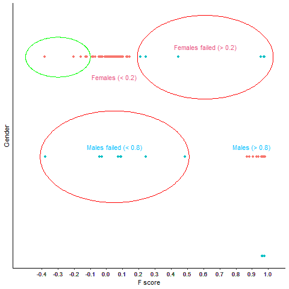

# Sex discrepency in a GWAS

## Identification of individuals with discordant sex information

This was the first step of QC, performed to identify subjects that have
inconclusive/contradictory gender information, as it can lead to
spurious associations. In a case-control study, samples that show the
wrong gender information are suggested to be excluded from further QC
and statistical analysis. Subjects were appropriately recoded or
removed, if information was inconclusive, for further analyses.

### X Chromosome Heterozygosity

In mammals, genetic sex is determined by the presence of sex
chromosomes: **males are typically XY** and **females are XX**. This
chromosomal difference has a direct impact on heterozygosity patterns on
the X chromosome. **Males**, having only one X chromosome, should appear
**homozygous** at X-linked SNPs, because there is only one allele
present at each position. **Females**, having two X chromosomes, can
carry two different alleles at each SNP, so they generally show **higher
heterozygosity** on the X chromosome.

### F-Statistic for Sex Determination

In GWAS, the **F-statistic** (or **inbreeding coefficient**) is used to
quantify the observed level of X chromosome heterozygosity relative to
the expected level. This metric helps infer **genetic sex** based on the
principle that males should have low heterozygosity on the X chromosome
(resulting in high F-statistic values), while females should have higher
heterozygosity (resulting in F values closer to zero).

### Inbreeding Coefficient (F)

The **inbreeding coefficient**, symbolized as **F**, is a measure of how
much **genetic similarity** (homozygosity) there is in an individual’s
genome **relative to what is expected** under random mating.

#### What Does It Mean?

-   **F = 0** → No inbreeding: the individual’s observed heterozygosity
    matches what you’d expect in the general population.
-   **F &gt; 0** → Some inbreeding: there is **more homozygosity** than
    expected, meaning the individual’s parents share common ancestry.
-   **F &lt; 0** → More heterozygosity than expected, which is rare but
    can occur due to certain population structures or genotyping noise.

In simple terms, **F** quantifies the probability that two alleles at
any locus are **identical by descent** (i.e., inherited from a common
ancestor).

#### Where Is It Used?

#### Population Genetics:

To estimate how inbred a population or an individual is — high F means
individuals are more related than random mating would suggest. This is
important for conservation biology, animal breeding, or isolated human
populations.

#### Sample QC in GWAS:

On autosomes, it flags samples with unexpectedly high or low
homozygosity:

-   High F can indicate inbreeding or close parental relatedness.
-   Extreme F can reveal lab contamination, sample mix-ups, or
    genotyping errors.

#### Sex Checks:

On the X chromosome, **F is used differently**: it measures
heterozygosity on the X to infer genetic sex. Males (XY) have only one X
→ low heterozygosity → F ≈ 1. Females (XX) have two Xs → higher
heterozygosity → F ≈ 0.

#### How is F Calculated?

In a simplified form:

$$
\Large F = \frac{H\_{exp} - H\_{obs}}{H\_{exp}}
$$

-   *H**e**x**p* = expected heterozygosity (based on allele
    frequencies).
-   *F**o**b**s* = observed heterozygosity in the sample.

The **inbreeding coefficient (F)** is a simple but powerful measure of
how much an individual’s genetic variation deviates from what’s expected
in a randomly mating population. It helps detect relatedness,
inbreeding, contamination, or sex inconsistencies — making it a core
metric in **genetic QC pipelines**.

#### PLINK command

    ./plink --bfile plink --check-sex --out Sex_Check

#### What each part means

<table>
<colgroup>
<col style="width: 55%" />
<col style="width: 44%" />
</colgroup>
<thead>
<tr>
<th style="text-align: left;">Part</th>
<th style="text-align: left;">Meaning</th>
</tr>
</thead>
<tbody>
<tr>
<td style="text-align: left;"><code>./plink</code></td>
<td style="text-align: left;">Run the PLINK software executable from the
current directory (<code>./</code> means “this folder”).</td>
</tr>
<tr>
<td style="text-align: left;"><code>--bfile plink</code></td>
<td style="text-align: left;">Use the <strong>binary PLINK
files</strong>: <code>plink.bed</code>, <code>plink.bim</code>, and
<code>plink.fam</code>. These 3 files together define your genotype
dataset.</td>
</tr>
<tr>
<td style="text-align: left;"><code>--check-sex</code></td>
<td style="text-align: left;">Run PLINK’s <strong>sex check</strong>
routine. This checks whether the genetically inferred sex matches the
sex reported in your <code>.fam</code> file.</td>
</tr>
<tr>
<td style="text-align: left;"><code>--out Sex_Check</code></td>
<td style="text-align: left;">Name the output files: e.g.,
<code>Sex_Check.sexcheck</code> will be created.</td>
</tr>
</tbody>
</table>

#### What does –check-sex actually do?

-   PLINK uses **X chromosome data** to estimate the inbreeding
    coefficient **F** for each sample:

    -   If F ≈ 1 → likely male (only one X chromosome → more
        homozygosity)
    -   If F ≈ 0 → likely female (two X chromosomes → more
        heterozygosity)

-   It then compares this estimate with the **sex** listed in your
    **.fam** file (column 5).

-   If there’s a mismatch, it flags it:

-   Possible reasons: sample swap, data entry error, or sex chromosome
    abnormality.

#### Ambiguous Cases

Sometimes, individuals fall into an **intermediate range** (e.g., **F
between 0.2 and 0.8**). These are flagged as **ambiguous sex**.
Ambiguity can arise from:

-   Biological factors, such as sex chromosome aneuploidies (e.g., XXY
    Klinefelter syndrome, XO Turner syndrome).
-   Technical issues, such as DNA contamination, genotyping error, or
    low-quality X chromosome SNPs.
-   Misreporting or sample mix-ups during collection or data entry.

#### Output

-   The main output is:
    -   Sex\_Check.sexcheck

<table>
<thead>
<tr>
<th>FID</th>
<th>IID</th>
<th>PEDSEX</th>
<th>SNPSEX</th>
<th>STATUS</th>
<th>F</th>
</tr>
</thead>
<tbody>
<tr>
<td>1</td>
<td>201320</td>
<td>2</td>
<td>2</td>
<td>OK</td>
<td>0.017</td>
</tr>
<tr>
<td>1</td>
<td>201320</td>
<td>1</td>
<td>1</td>
<td>OK</td>
<td>0.976</td>
</tr>
<tr>
<td>1</td>
<td>201327</td>
<td>2</td>
<td>1</td>
<td>PROBLEM</td>
<td>0.974</td>
</tr>
<tr>
<td>1</td>
<td>201335</td>
<td>2</td>
<td>0</td>
<td>PROBLEM</td>
<td>0.456</td>
</tr>
<tr>
<td>1</td>
<td>201342</td>
<td>1</td>
<td>2</td>
<td>PROBLEM</td>
<td>0.632</td>
</tr>
<tr>
<td>1</td>
<td>201359</td>
<td>1</td>
<td>0</td>
<td>PROBLEM</td>
<td>0.321</td>
</tr>
</tbody>
</table>

-   Each row has:

    -   FID
    -   IID
    -   PEDSEX: The reported sex in our `.fam` file
    -   SNPSEX: The inferred sex estimated from the genotype data
    -   STATUS (OK, PROBLEM)
    -   F: Give value. If it is &lt; 0.2, sample is suggested as female
        and if score is &gt; 0.8 sample is represented as male.

-   The above command also provide a log file, here
    `GWAS_Sex_Check.log`, that provides many information including
    number of cases and controls, males and females count, individuals
    with ambiguous code, etc

-   Extract the IDs of individuals with discordant sex information. In
    situations where discrepancies cannot be resolved, remove the
    individuals through following command.

<!-- -->

    Gender <- read.table("Sex_check_1.sexcheck", header = T, as.is = T) %>%
      na.omit()
    png("Gender_check.png")

    ggplot(Gender, aes(x=F, y= PEDSEX, col = STATUS))+
      geom_point()+
      labs(y="Gender", x = "F score")+
      theme_classic()+
      scale_x_continuous(breaks = round(seq(min(Gender$F), 1, by = 0.01), 1))+
      theme(strip.text.x = element_blank())+
      geom_circle(aes(x0 = 0.61,  y0 = 2, r = 0.42),
                  inherit.aes = FALSE,
                  col = "Red")+
      geom_circle(aes(x0 = 0.05,  y0 = 1, r = 0.46),
                  inherit.aes = FALSE,
                  col = "Red")+
      theme(axis.text.y = element_blank(),
            axis.ticks.y = element_blank(),
            legend.position = "none")+
      annotate(geom="text", x=-0.2, y=2.1, label="Females (< 0.2)",
               color="#e75480")+
      annotate(geom="text", x=0.9, y=1.1, label="Males (> 0.8)",
               color="#00bfff")+
      annotate(geom="text", x=0.61, y=2.1, label="Females failed (> 0.2)",
               color="#e75480")+
      annotate(geom="text", x=0.05, y=1.1, label="Males failed (< 0.8)",
               color="#00bfff")
    dev.off()

The above R script will create a png file containing information based
on STATUS column and differentiate males, females and ambiguous data
separately.

Discordant Sex information

The above figure explains Individuals Discordant sex information.
Samples failed QC are in red circle. Some samples also showed value less
than 0. It is good to cross check these samples.

If observed heterozygosity **(*H**o**b**s*) is higher than
expected**, the F-statistic can drop below zero. \* For females, F
should be around 0. \* Small negative values (like -0.05 to -0.2) are
very common and not a concern. \* But -0.3, -0.4, or lower means the
observed heterozygosity is quite a bit higher than expected.

Sometimes mild negatives are normal noise.

But **strongly negative F scores** (e.g., &lt; -0.3) are unusual — they
can indicate: \* **Bad SNP calls** on the X chromosome. \* **Poor
genotyping quality** → excess false heterozygotes. \*
**Cross-contamination** → mixed DNA causes extra heterozygosity. \*
**Mislabeled sex** → e.g., truly male but showing high heterozygosity
due to error. \* **Aneuploidy** (very rare, e.g., XXY Klinefelter, or
mosaicism).

#### What we should do

-   **Check sample call rates** → Is this sample’s X chromosome call
    rate low?
-   **Inspect heterozygosity plots** → Are these outliers compared to
    other females?
-   **Look at the sex field in your metadata** → Is the reported sex
    consistent with the F value?
-   **Visualize with a scatterplot** — e.g., plot F vs. autosomal
    heterozygosity — true females should cluster near zero, males near
    one.

### Removing failed gender

    Failed_gender <- Gender %>% 
      filter(STATUS != "OK") %>% 
      select(1:2) # selecting only FID, IID

    ## Saving file 
    write.table(Failed_gender,"discordant-sex-individuals-file.txt", 
                row.names = FALSE, 
                col.names = FALSE,
                quote = FALSE)

File `“discordant-sex-individuals-file.txt”`, should contain only FID
and IID of the individuals that have to be removed)

<table>
<thead>
<tr>
<th>FID</th>
<th>IID</th>
</tr>
</thead>
<tbody>
<tr>
<td>1</td>
<td>201320</td>
</tr>
<tr>
<td>1</td>
<td>201327</td>
</tr>
<tr>
<td>1</td>
<td>201335</td>
</tr>
<tr>
<td>1</td>
<td>201342</td>
</tr>
<tr>
<td>1</td>
<td>201359</td>
</tr>
</tbody>
</table>

#### PLINK command to remove the individuals based on sex information

    plink --bfile raw_GWAS_data --remove discordant-sex-individuals-file.txt --make-bed --out 1_QC_Raw_GWAS_data

-   **NOTE**: We can also remove all failed individuals at last stage
    too.

#### Why the Sex Check Matters

A sex-check is a **crucial step** in GWAS QC pipelines because
**mismatches between reported and genetically inferred sex** can signal
**serious problems**, like mislabelled samples, swaps, or data entry
errors. Such discrepancies can introduce bias and reduce confidence in
downstream analyses. Therefore, samples with sex mismatches are often
flagged for removal or further investigation.

#### Beyond Basic Sex-Check

While the F-statistic provides a straightforward method for inferring
sex, it is not foolproof. Some ambiguous results may be true biological
cases rather than errors — for example, chromosomal anomalies or
differences in recombination. For suspicious or ambiguous cases,
researchers often complement the F-statistic with additional checks,
such as:

-   Examining **Y chromosome SNPs** to confirm the presence or absence
    of the Y chromosome.
-   Reviewing reported phenotype information or clinical records for
    consistency.
-   Performing visual checks of heterozygosity plots for unexpected
    outliers.

Together, these measures ensure that sex is correctly assigned,
supporting the **accuracy and integrity of the entire GWAS dataset**.

The **sex-check using X chromosome heterozygosity and the F-statistic**
is a simple but vital safeguard in GWAS pipelines. Combined with other
quality control checks, it helps ensure that the dataset is free of
mismatches, mix-ups, or anomalies — which is essential for valid,
reproducible genetic association results.

#### References

-   Hartl DL, Clark AG (2007). Principles of Population Genetics (4th
    ed.). Sinauer Associates.

-   Weir BS, Cockerham CC (1984). Estimating F-Statistics for the
    Analysis of Population Structure. Evolution 38(6): 1358–1370.

-   Anderson CA, Pettersson FH, Clarke GM, Cardon LR, Morris AP,
    Zondervan KT (2010). Data quality control in genetic case-control
    association studies. Nat Protoc 5(9):1564–1573.

-   Purcell S, Neale B, Todd-Brown K, et al. (2007). PLINK: A Tool Set
    for Whole-Genome Association and Population-Based Linkage Analyses.
    Am J Hum Genet 81(3): 559–575.

-   Wray NR, Wijmenga C, Sullivan PF, Yang J, Visscher PM (2018). Common
    Disease Is More Complex Than Implied by the Core Gene Omnigenic
    Model. Cell 173(7): 1573–1580.
