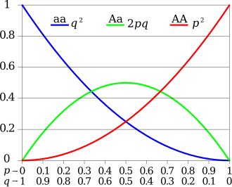

# Hardy–Weinberg Equilibrium (HWE)

**HWE** is a **fundamental principle** in population genetics that
describes how **allele and genotype frequencies** behave in an
**idealized population** from one generation to the next — **if certain
assumptions hold true**. The law is named after G.H. Hardy and Wilhelm
Weinberg.

#### Basic idea behind HWE

If:

-   There is random mating,
-   No selection,
-   No mutation,
-   No migration,
-   And a very large population size,

then the **allele frequencies** at a given locus remain **constant**
over generations. As a result, the **genotype frequencies** can be
predicted directly from the allele frequencies using a simple binomial
distribution.

#### The classic formula

Suppose you have:

-   Two alleles: **A** and **a**.
-   The frequency of allele A = **p**.
-   The frequency of allele a = **q**.

Then:

$$
\large p + q = 1
$$

The expected genotype frequencies are:

-   AA (dominant homozygous frequency):*p*2
-   Aa (heterozygous frequency):2pq
-   aa (recessive homozygous frequency):*q*2

and

$$
\large p^2 + 2pq + q^2 = 2
$$

#### Example:

If allele A has frequency 0.7 and a has frequency 0.3: \* AA:
0.72 = 0.49 \* Aa: 2 x 0.7 x 0.3 = 0.42 \* aa:
0.32 = 0.09

So we expect ~49% AA, 42% Aa, and 9% aa in the population.

#### Why is HWE useful?

HWE gives you a **baseline expectation** for how genotypes should be
distributed **if there’s no weirdness** happening at that locus in your
population.

If you observe **large deviations** from HWE:

-   It suggests something interesting or problematic is going on.
-   It could be **biological**: selection, inbreeding, non-random
    mating.
-   Or **technical**: genotyping errors, batch effects, population
    stratification, sample contamination.

#### Why test for HWE in GWAS QC?

In GWAS, you usually:

-   Test HWE **in controls only**, not cases.
-   Why? Because the disease itself may cause true deviations in cases.

A **SNP with big HWE deviation in controls** is a red flag:

-   Maybe the genotyping assay failed at that site.
-   Maybe there’s allele dropout.
-   Maybe there’s cryptic population structure.

So you **exclude** SNPs that deviate strongly from HWE in controls,
using a **stringent p-value** cutoff (e.g., p &lt; 1e–6).

We keep only SNPs that behave as expected under simple population
genetics — boosting trust that any association you see is real, not an
artifact.

#### How is HWE tested?

-   We calculate the **expected genotype frequencies** from the observed
    allele frequencies.
-   We compare the **expected vs. observed** using a simple test
    statistic — usually a **chi-square test** or exact test.
-   If the difference is significant, we flag that SNP.

#### When is HWE violation biologically meaningful?

HWE is not only a QC filter — it can also reveal real biology:

-   Deviations might reflect **selection pressure** at that site.
-   Or **inbreeding**, which reduces heterozygosity.
-   Or **population substructure** (e.g., if your sample includes mixed
    ancestries).

So **for controls** → big deviations usually mean technical problems →
filter them out.

**For cases** → true signals can break HWE, so we **do not filter** by
HWE there.

#### Key takeaway

HWE is a simple but powerful sanity check:

> Are my genotype frequencies what I’d expect if nothing weird is
> happening?

Testing for HWE:

-   Catches genotyping problems.

-   Protects us from spurious signals.

-   Is a standard part of every GWAS pipeline.

-   If the frequency of observed genotypes of a variant in a population
    can be derived from the observed allele frequencies, the genetic
    variant is said to be in HWE.

-   Genotype frequencies remain stable from one generation to another in
    the absence of any evolutionary pressure (selection, mutation and
    migration).

-   The goodness-of-fit test is used to test HWE is not a powerful test
    and reliability of results depends on the sample size.

<table>
<thead>
<tr>
<th>Sample size</th>
<th>50</th>
<th>100</th>
<th>200</th>
<th>300</th>
<th>400</th>
</tr>
</thead>
<tbody>
<tr>
<td>AA count</td>
<td>21</td>
<td>42</td>
<td>84</td>
<td>126</td>
<td>168</td>
</tr>
<tr>
<td>AB count</td>
<td>25</td>
<td>50</td>
<td>100</td>
<td>150</td>
<td>200</td>
</tr>
<tr>
<td>BB count</td>
<td>4</td>
<td>8</td>
<td>16</td>
<td>24</td>
<td>32</td>
</tr>
<tr>
<td>HWE p value</td>
<td>0.52</td>
<td>0.26</td>
<td>0.08</td>
<td><strong>0.02</strong></td>
<td><strong>0.009</strong></td>
</tr>
</tbody>
</table>

Source: Genetic Epidemiology: Mehmet T Dorak

-   **Rule of thumb**: the heterozygote frequency can only reach a
    maximum of 50%. If heterozygote frequencies are more than 50%, it is
    a clear sign of HWD, regardless of statistical test result.

Hardy–Weinberg principle

[Image
Credit](https://en.wikipedia.org/wiki/Hardy%E2%80%93Weinberg_principle)

-   Most common reason is not biological, **genotyping error** is most
    plausible exploration.

#### References

-   Anderson CA et al., Nature Protocols 2010: Classic QC SOP.
-   Wigginton JE et al., Am J Hum Genet 2005: Exact test for HWE.
