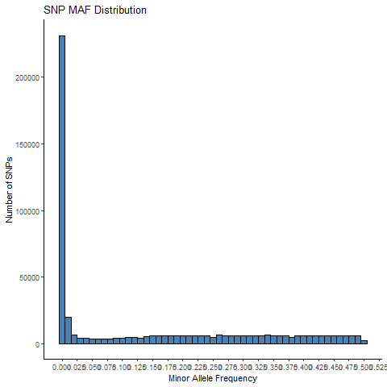

# Minor Allele Frequency (MAF)

-   For any SNP, there are usually **two alleles**: a major (more
    common) allele and a minor (less common) allele.

-   The **minor allele frequency (MAF)** is simply the **proportion** of
    the less common allele in the population.

#### Example:

If we genotype 100 individuals:

-   60 have AA → 120 A alleles
-   30 have AT → 30 A + 30 T = 60 total alleles
-   10 have TT → 20 T alleles

Total alleles = 200

T (minor) allele count = 50 → MAF = 50/200 = 0.25

So the MAF for allele T at that SNP is **0.25**.

#### Why does MAF matter?

In GWAS we care because:

-   Low MAF SNPs often have **unstable frequency estimates**, especially
    in small or moderate-sized samples.

-   A SNP with MAF = 0.001 might only have 2–3 copies in our dataset —
    so the counts are so small that the statistics become unreliable.

-   Small allele counts inflate standard errors and can produce
    **inflated or deflated test statistics**.

#### Technical reasons to remove low-MAF SNPs

#### 1. Genotyping accuracy:

-   Rare alleles are **harder to call** correctly.
-   A few genotyping errors can dramatically shift frequency or create
    spurious heterozygotes for a rare allele.

#### 2. Missingness impact:

-   If only a handful of copies exist, missing a single genotype can
    heavily distort the true MAF.

#### 3. QC thresholds depend on sample size:

-   In small GWAS (e.g., a few thousand samples), we may remove SNPs
    with MAF &lt; 0.01 (1%) or &lt; 0.05 (5%).

-   In huge studies (&gt;50,000), lower MAF cutoffs (like 0.005 or even
    0.001) are more reasonable — because there are still enough copies
    to estimate the frequency robustly.

#### Biological reasons to remove low-MAF SNPs (for standard GWAS)

#### 1. Low power to detect association:

-   If a SNP is very rare, we likely **don’t have enough carriers** to
    test whether it’s associated with our trait — our test simply has no
    power.

#### 2. HWE can’t be tested meaningfully:

-   For very rare SNPs, genotype counts are too sparse to meaningfully
    test HWE, which limits our QC checks.

#### 3. Common GWAS assumptions break down:

Standard GWAS tests (chi-square, logistic regression) assume large
sample sizes and enough counts in each genotype group. Rare SNPs violate
this.

#### Key point:

This doesn’t mean rare variants aren’t biologically interesting — they
absolutely are! But **testing them well** requires:

-   **Very large samples**, or
-   **Specialized methods** like rare variant burden tests, not standard
    single-SNP GWAS tests.

#### What typical MAF thresholds look like

<table>
<thead>
<tr>
<th>Study Size</th>
<th>Common MAF filter</th>
</tr>
</thead>
<tbody>
<tr>
<td>Small cohort (&lt;5,000)</td>
<td>MAF ≥ 0.05 (5%)</td>
</tr>
<tr>
<td>Medium GWAS</td>
<td>MAF ≥ 0.01 (1%)</td>
</tr>
<tr>
<td>Large biobank</td>
<td>MAF ≥ 0.005 or 0.001</td>
</tr>
<tr>
<td>Sequencing/rare tests</td>
<td>Use <strong>burden tests</strong> instead of filtering</td>
</tr>
</tbody>
</table>

#### PLINK command to calculate MAF

    ./plink --bfile 4_QC_Raw_GWAS_data --freq --out MAF_check

#### Visualize MAF

    library(data.table)
    library(ggplot2)

    # Read .frq
    frq <- fread("D:/UNIX/GWAS/plink_linux_x86_64_20230116/Sex_check/Missing_Heter/Relatedness/PCA/HWE/SNP_missing/MAF/MAF_check.frq")

    # Quick histogram
    png("MAF.png")
    ggplot(frq, aes(x = MAF)) +
      geom_histogram(binwidth = 0.01, fill = "steelblue", color = "black") +
      labs(
        title = "SNP MAF Distribution",
        x = "Minor Allele Frequency",
        y = "Number of SNPs"
      ) +
      scale_x_continuous(
        breaks = seq(0, 1, by = 0.025)   # ticks at 0, 0.1, 0.2, ..., 1.0
      ) +
      theme_classic()

Histogram Representing Minor Allele Frequency in the data

This creates:

-   `MAF_check.frq` → allele frequencies for all SNPs

<table>
<thead>
<tr>
<th>CHR</th>
<th>SNP</th>
<th>A1</th>
<th>A2</th>
<th>MAF</th>
<th>NCHROBS</th>
</tr>
</thead>
<tbody>
<tr>
<td></td>
<td></td>
<td></td>
<td></td>
<td></td>
<td></td>
</tr>
</tbody>
</table>

#### Pick a sensible MAF threshold for 200 samples

Total chromosomes = 400. Suppose our MAF cutoff is 1% → that means
minimum 4 minor alleles.

BUT, having only 4 alleles gives very unstable statistics → especially
if missingness exists.

**Typical rule for small GWAS**:

-   For n = 200, a **MAF cutoff of 5% **is reasonable.

-   This means we expect ~20 minor alleles (5% of 400) → gives enough
    counts for stable association tests.

So we use **0.05** as your threshold.

**NOTE**: The chip used to perform GWAS contains lots or rare varitants.
Hence, they will be removed from final analysis

#### PLINK command to filter SNPs failing call rate and MAF

    ./plink --bfile 4_QC_Raw_GWAS_data --maf 0.05 --geno 0.01 --make-bed --out Fin
    al_QC_SNPs

This removes:

-   SNPs with MAF &lt; 5%

-   SNPs with &gt;1% missingness

# References

1- Marees, A.T., et al, 2018. A tutorial on conducting genome‐wide
association studies: Quality control and statistical analysis. *Int J
Methods Psychiatr Res*, Jun; 27(2): e1608.

2- Anderson, C.A. et al, 2010. Data quality control in genetic
case-control association studies. *Nat Protoc*, Sep:5(9):1564-73

3- Singh, Sandeep Kumar, “A Case-Only Genome-wide Association Study of
Gender- and Age-specific Risk Markers for Childhood Leukemia” (2015).
FIU Electronic Theses and Dissertations. 1832

4- Ricopili pipeline (PGC): does HWE control-only first → then combines
other filters.
