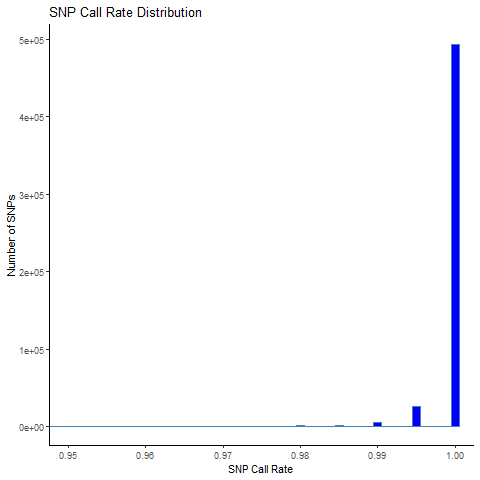

# SNP Call rate

SNP call rate means:

-   For each SNP, what **percentage of samples** have a valid genotype
    call.
-   The flip side is **missingness** — how many samples failed to get a
    genotype call for that SNP.

#### Example:

We have 1,000 samples.

-   SNP\_A is successfully genotyped in 990 samples → Call rate = 99% →
    Missingness = 1%.

-   SNP\_B has only 940 good calls → Call rate = 94% → Missingness = 6%.

#### Why filter by SNP call rate?

SNPs with **lots of missing calls** often fail due to:

-   Poor probe performance on the genotyping chip.
-   Lab contamination.
-   Batch-specific technical failures.

Including them can:

-   Add noise.

-   Bias allele frequency estimates.

-   Cause false positives if missingness correlates with case/control
    status.

**Good genotyping labs usually produce SNPs with &gt;98–99% call
rates.**

-   So typical GWAS filters remove SNPs missing in more than 2–5% of
    samples.

#### PLINK command used to calculate the missingness

    ./plink --bfile 4_QC_Raw_GWAS_data --missing --out SNP_missingness

This step does two things:

-   Makes `SNP_missingness.imiss` → individual-level missingness

-   Makes `SNP_missingness.lmiss` → locus-level (SNP-level) missingness

We want `SNP_missingness.lmiss`.

#### What’s in .lmiss?

<table>
<thead>
<tr>
<th style="text-align: left;">CHR</th>
<th style="text-align: left;">SNP</th>
<th style="text-align: left;">N_MISS</th>
<th style="text-align: left;">N_GENO</th>
<th style="text-align: left;">F_MISS</th>
</tr>
</thead>
<tbody>
<tr>
<td style="text-align: left;">1</td>
<td style="text-align: left;">rs1234</td>
<td style="text-align: left;">2</td>
<td style="text-align: left;">1000</td>
<td style="text-align: left;">0.002</td>
</tr>
<tr>
<td style="text-align: left;">1</td>
<td style="text-align: left;">rs5678</td>
<td style="text-align: left;">15</td>
<td style="text-align: left;">980</td>
<td style="text-align: left;">0.015</td>
</tr>
</tbody>
</table>

-   **N\_MISS** = number of missing genotypes at this SNP
-   **N\_GENO** = number of genotypes called at this SNP
-   **F\_MISS** = proportion missing → so Call Rate = 1 − F\_MISS

#### Visualize call rate distribution

    lmiss <- fread("D:/UNIX/GWAS/plink_linux_x86_64_20230116/Sex_check/Missing_Heter/Relatedness/PCA/HWE/SNP_missing/SNP_missingness.lmiss")
    # Add SNP call rate column
    lmiss$CallRate <- 1 - lmiss$F_MISS

    # Check it
    head(lmiss)

    # Plot distribution of SNP call rates
    png("SNP_callrate.png")
    ggplot(lmiss, aes(x = CallRate)) +
      geom_histogram(binwidth = 0.001, fill = "Blue", color = "STEELBLUE") +
      labs(
        title = "SNP Call Rate Distribution",
        x = "SNP Call Rate",
        y = "Number of SNPs"
      ) +
      scale_x_continuous(
        breaks = seq(0, 1, by = 0.01)   # ticks at 0, 0.1, 0.2, ..., 1.0
      ) +
      coord_cartesian(xlim = c(0.95, 1.0)) + # focuses the zoom but bins remain complete 
      theme_classic()

SNP call rate

#### interpret

-   Most good SNPs should cluster near 1.0 (100% call rate).
-   SNPs with low call rates (big missingness) show up in the left tail.
-   Typically we drop SNPs with call rate &lt; 95–98% (missingness &gt;
    2–5%).

Based on the image we will choose a more strict threshold (99%) to drop
the SNPs. These SNPs will be dropped in next step during MAF.

#### References

1- Marees, A.T., et al, 2018. A tutorial on conducting genome‐wide
association studies: Quality control and statistical analysis. *Int J
Methods Psychiatr Res*, Jun; 27(2): e1608.

2- Anderson, C.A. et al, 2010. Data quality control in genetic
case-control association studies. *Nat Protoc*, Sep:5(9):1564-73

3- Singh, Sandeep Kumar, “A Case-Only Genome-wide Association Study of
Gender- and Age-specific Risk Markers for Childhood Leukemia” (2015).
FIU Electronic Theses and Dissertations. 1832
